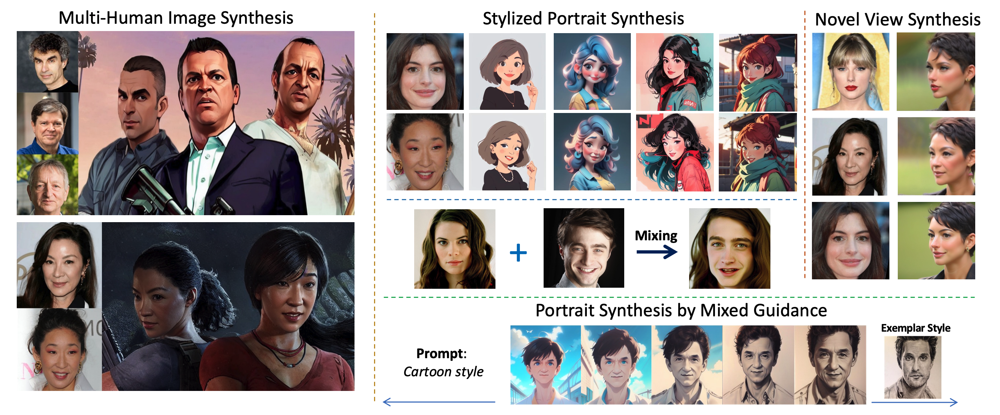

# Official Repo for FaceStudio
 
 

**FaceStudio: Put Your Face Everywhere in Seconds**

*Yuxuan Yan, [Chi Zhang](https://icoz69.github.io/), Rui Wang, Yichao Zhou, Gege Zhang, Pei Cheng, Bin Fu, Gang Yu*

## News
(23/12/05) We are going to release the code soon.

## Abstract

This study investigates identity-preserving image synthesis, an intriguing task in image generation that seeks to maintain a subject's identity while adding a personalized, stylistic touch. Traditional methods, such as Textual Inversion and DreamBooth, have made strides in custom image creation, but they come with significant drawbacks. These include the need for extensive resources and time for fine-tuning, as well as the requirement for multiple reference images. To overcome these challenges, our research introduces a novel approach to identity-preserving synthesis, with a particular focus on human images. Our model leverages a direct feed-forward mechanism, circumventing the need for intensive fine-tuning, thereby facilitating quick and efficient image generation. Central to our innovation is a hybrid guidance framework, which combines stylized images, facial images, and textual prompts to guide the image generation process. This unique combination enables our model to produce a variety of applications, such as artistic portraits and identity-blended images. Our experimental results, including both qualitative and quantitative evaluations, demonstrate the superiority of our method over existing baseline models and previous works, particularly in its remarkable efficiency and ability to preserve the subject's identity with high fidelity.

## Demos

Coming soon.

## Code

Coming soon.

## Cite

To be updated.
